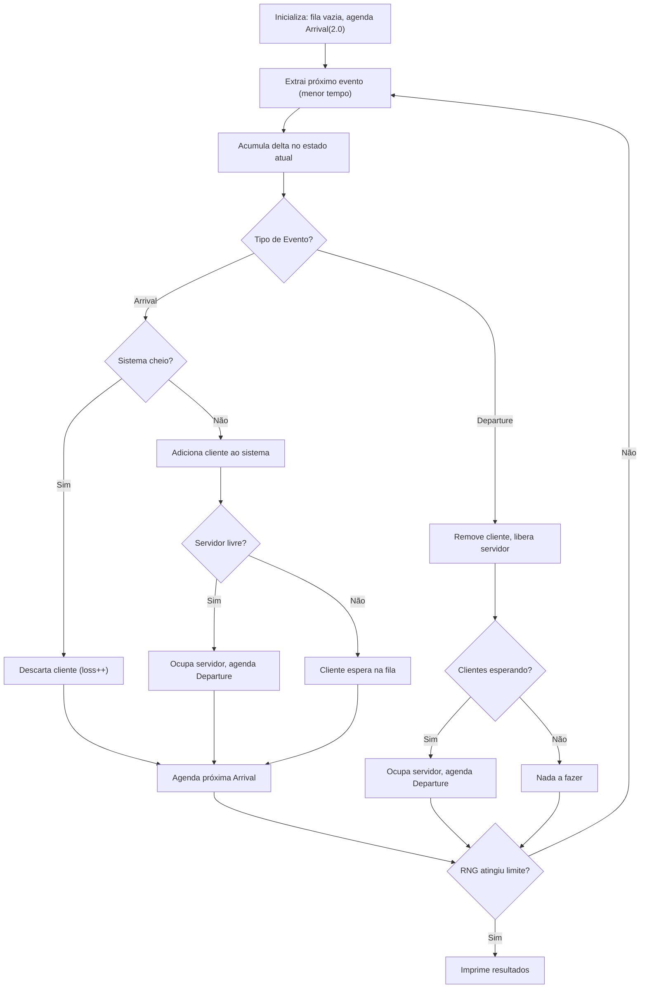

# QueueSimulator — Simulador de Filas G/G/c/K

## Resumo

Projeto Rust completo implementando simulação de filas de eventos discretos (DES) baseada na notação de Kendall.

## Arquitetura de Módulos

| Módulo | Arquivo | Responsabilidade |
|--------|---------|-----------------|
| **Config** | [config.rs](file:///Users/rodrigo/Faculdade/SetimoSemestre/Simulacao/QueueSimulator/src/config.rs) | Deserialização JSON + validação de parâmetros |
| **RNG** | [rng.rs](file:///Users/rodrigo/Faculdade/SetimoSemestre/Simulacao/QueueSimulator/src/rng.rs) | Gerador Congruente Linear com estado encapsulado |
| **Event** | [event.rs](file:///Users/rodrigo/Faculdade/SetimoSemestre/Simulacao/QueueSimulator/src/event.rs) | Enum `Arrival(f64)`/`Departure(f64)` com ordenação reversa |
| **Scheduler** | [scheduler.rs](file:///Users/rodrigo/Faculdade/SetimoSemestre/Simulacao/QueueSimulator/src/scheduler.rs) | Min-heap via `BinaryHeap` com ordering invertido |
| **QueueState** | [queue_state.rs](file:///Users/rodrigo/Faculdade/SetimoSemestre/Simulacao/QueueSimulator/src/queue_state.rs) | Acumulação de tempo por estado, controle de servidores, loss |
| **Simulator** | [simulator.rs](file:///Users/rodrigo/Faculdade/SetimoSemestre/Simulacao/QueueSimulator/src/simulator.rs) | Orquestrador principal do loop de eventos |
| **Main** | [main.rs](file:///Users/rodrigo/Faculdade/SetimoSemestre/Simulacao/QueueSimulator/src/main.rs) | Entry point: CLI arg, config loading, execução |

## Fluxo do Loop Principal



## Resultado da Execução (G/G/1/5, 100k chamadas RNG)

```
╔══════════════════════════════════════════════════╗
║        RESULTADOS DA SIMULAÇÃO G/G/1/5         ║
╠══════════════════════════════════════════════════╣
║  Estado │  Tempo Acumulado  │  Probabilidade     ║
╠─────────┼───────────────────┼────────────────────╣
║      0  │       62302.1807  │          0.499224  ║
║      1  │       61706.2351  │          0.494449  ║
║      2  │         789.5212  │          0.006326  ║
║      3  │           0.0000  │          0.000000  ║
║      4  │           0.0000  │          0.000000  ║
║      5  │           0.0000  │          0.000000  ║
╠══════════════════════════════════════════════════╣
║  Tempo global total:                 124797.9370  ║
║  Clientes perdidos (loss):                     0  ║
╚══════════════════════════════════════════════════╝
```

## Testes

5 testes unitários passando:
- `rng_produces_values_in_unit_interval` — Valores no intervalo [0, 1)
- `rng_count_tracks_calls` — Contador de chamadas
- `rng_range_respects_bounds` — Geração em range [min, max)
- `rng_is_deterministic` — Mesma seed → mesma sequência
- `min_heap_behavior` — BinaryHeap retorna menor tempo primeiro

## Como Usar

```bash
# Compilar e rodar com config.json padrão
cargo run

# Especificar outro arquivo de configuração
cargo run -- outra_config.json

# Rodar testes
cargo test
```

## Decisões de Design

- **Sem variáveis globais**: todo estado está encapsulado nas structs
- **Ordenação reversa no Event**: transforma max-heap em min-heap sem wrapper `Reverse`
- **RNG com contador**: condição de parada precisa (exatamente N chamadas)
- **Validação na Config**: asserts descritivos para parâmetros inválidos
- **Separação de concerns**: cada módulo tem responsabilidade única
